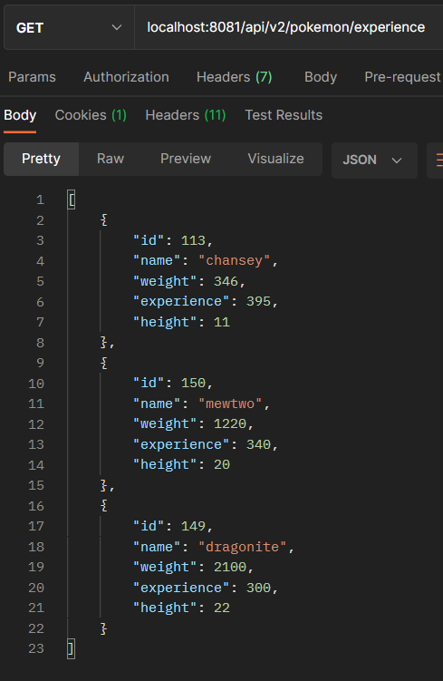

# Abstract

This is my approach to solution of Wefox Java Challenge for juniors. This challenge was to develop a Pokemon api rest from a given Docker container.

# Problems faced in setting up the working environment

To begin with, I will describe two problems I have found in the settings of working environment.

## Deprecated PokeAPI/pokekotlin maven dependency

After building Docker container, the Pokekotlin dependency of `pom.xml` was unable to find by maven. After research in google and ask a friend for help we found that the dependency was deprecated due to a security issue. So I had to update `pom.xml` with the latest Pokekotlin dependency available in GitHub.

Deprecated dependency:
```
<groupId>me.sargunvohra.lib</groupId>
<artifactId>pokekotlin</artifactId>
<version>2.3.0</version>
```

Updated dependency:
```
<groupId>com.github.PokeAPI</groupId>
<artifactId>pokekotlin</artifactId>
<version>2.3.1</version>
```

## Conflict between project PostgreSQL setting and my local PostgreSQL setting

I had to modify `docker-compose.yml` because the default setting for postgres ports was `5432:5432` and it generated conflict with another local setting that I had previously configured. So I changed the settings in this project to `5437:5432`.
For the same reason I had to set `server.port=8081` in `resources/application.properties`.

# Approach to solution

Secondly, I'll explain my approach to solution to the exercise. I have tried to take advantage as much as possible of dependencies provided in the initial package like lombok and jpa to reduce the verbosity of the code and to save me some work (like running sql queries).

## Project Architectural Pattern

I have followed a Model-View-Controller pattern for the API. So I deleted the given `PokemonApi.java` and created several packages with their classes:
- Application.java: contains the main method of our SpringBootApplication. If the DB is empty, it also initialises the data in the DB.
- Model Package: to define our entity model. JPA works hard for us, and we don't need a sql query.
- Repository Package: to define some methods for data access. Really very simplified thanks to JPA.
- Service Package: contains business logic.
- Controller Package: to define our endpoints and controlling the user interaction with MVC application.
- Configuration Package: to set some basic security requirements.

## Database

I access the provided PokeAPI to recover only the data I want/need and create a simple DB formed by one table with 1 primary key and 5 columns.
The DB is filled with some data about Pokemon first gen. But only is created and filled if it is empty.
If DB is empty, SpringBootApplication needs about 45 seconds to get started (in my laptop).
If DB already exists, SpringBootApplication needs about 4 seconds to get started (in my laptop).

## Security

Each endpoint require basic authorization (except endpoint for top 3 heaviest Pokemon because the challenge required it) so I have set appropriately in `resources/application.properties`:
```
spring.security.user.name=wefox
spring.security.user.password=1234
```

# Possible improvements to implement:

Then, I'll indicate possible improvements to implement in my code.

### Modify the create method to doesn't allow overwriting of existing data
The current `create` method of `PokemonRestController.java` not only insert new Pokemon into DB but also overwrites exiting data (if you choose an existing `id` for `RequestBody`). An improvement could be to assess whether data already exists and not to allow the insert if it exists.

### Implement unit testing
The endpoints and methods have been tested via debug and manually so an improvement could be implementing unit tests. For example, using JUnit 5.

# Wefox Java Challenge

>Finally, I have kept the original challenge statement below, and I post some images and code to show my results:

- This is a Spring Boot Application with all needed dependencies included in the POM file.
- Feel free to change the project architecture or any relevant configuration.
- You have a docker file to run a postgresDB.
- Add as many tests as you need.

### Exercise

1 - Implement REST API to retrieve:

- Pokemons whose name starts with {parameter}


- The 3 heaviest Pokemons


- the 3 Pokemons with more base experience



2 - Configure the heaviest pokemons endpoint to avoid spring security.
> I placed this line in `SecurityConfiguration.java`
```
web.ignoring().antMatchers("/api/v2/pokemon/heaviest");
```

3 - Create a sql script to create the necessary tables and column in the DB to store the pokemon information.
> I solved this part implementing the method `findFirstGenPokemonData()` in `Application.java` and using JPA annotations in `Pokemon.java`.

4 - Create remaining CRUD endpoints for pokemons using DB entities.
> Create


> Read


> Update


> Delete


### Infrastructure

The required infrastructure is already provided. All you need to do is to
install [Docker Engine]("https://docs.docker.com/get-docker/") and to use docker-compose to start
the services.

To start the services run `docker-compose up`. Use `-d` to start in detached mode and run the
containers in the background.

For a more detailed information about docker-compose commands refer to the official
documentation: [Overview of Docker Compose](https://docs.docker.com/compose/).